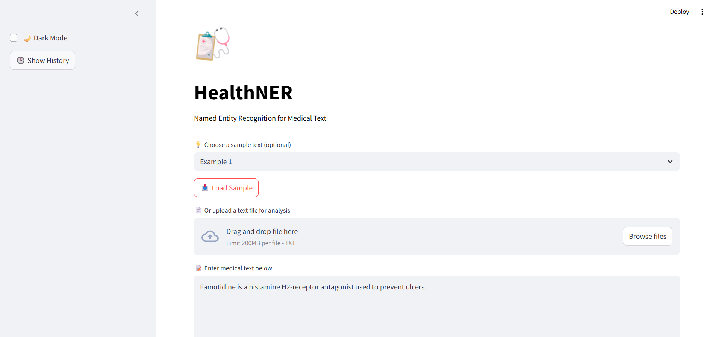
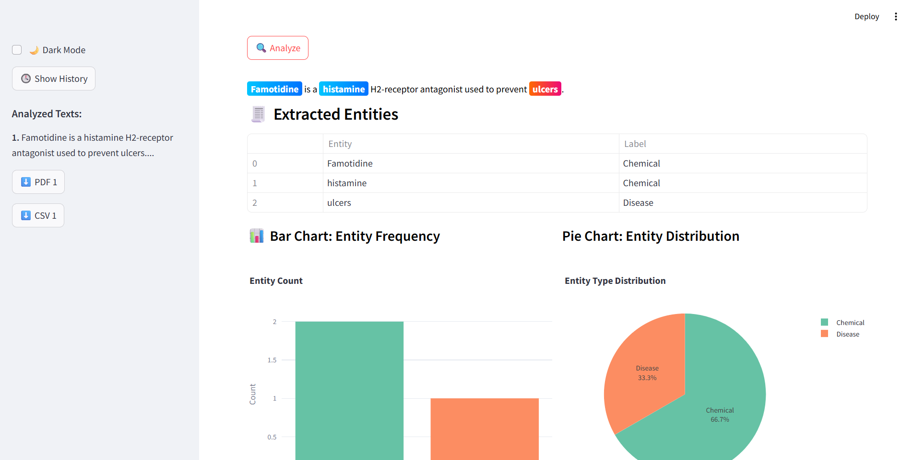

# 🧠 HealthNER

This project builds a machine learning-based system to automatically extract key medical information such as **patient names**, **diseases**, **symptoms**, and **medications** from unstructured clinical text.  
It leverages **spaCy’s NLP capabilities** to identify and label these entities, transforming messy text into structured data.

---

## 📸 Demo Screenshots

### 📝 Input UI


### 📊 Output Results


## 🔍 Features
- Medical NER (Disease, Chemical, etc.)
- File Upload & Direct Text Input
- Entity Visualization
- Charts (Bar + Pie)
- Export Results as PDF/CSV

## 🚀 Run the App
```bash
streamlit run streamlit_app.py
