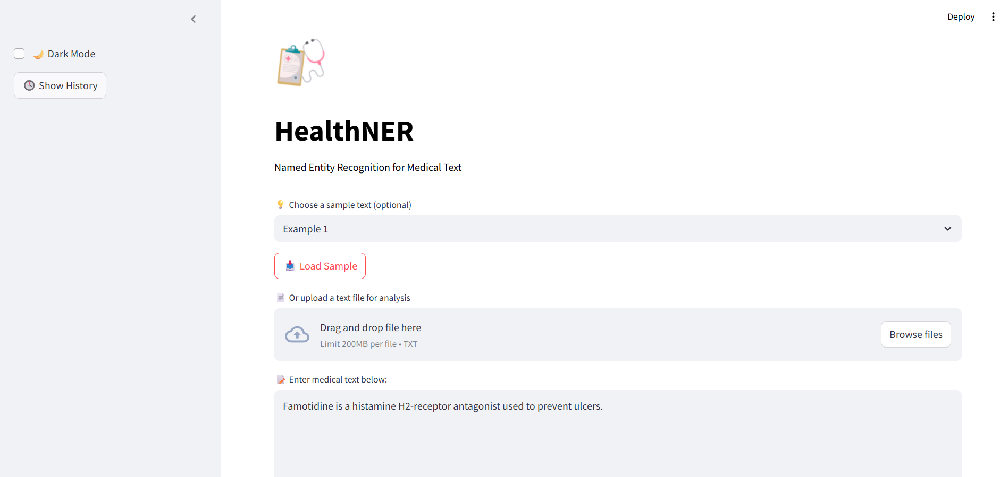
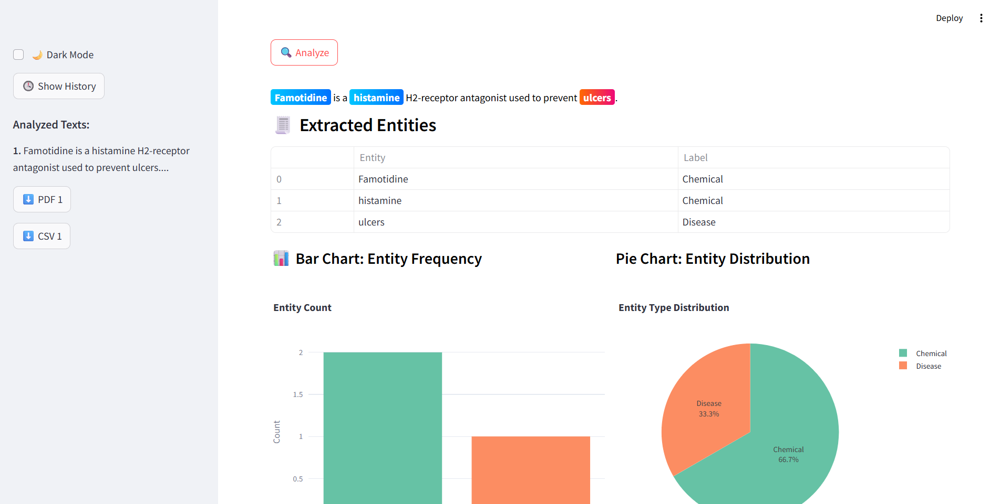

# 🩺 HealthNER

HealthNER is a Natural Language Processing (NLP) project built using [spaCy](https://spacy.io/) to automatically extract meaningful medical entities such as **diseases**, **symptoms**, and **drugs** from unstructured clinical text. This allows healthcare data to be converted into a more structured and analyzable format.

## 🌐 Live Demo
**Try it now:** [https://heallthner.streamlit.app/](https://heallthner.streamlit.app/)

---

## 🚀 Key Features
- 🔍 Extracts **Diseases**, **Symptoms**, and other entities from raw medical text
- 🧠 Trains a custom Named Entity Recognition (NER) model using the **NCBI Disease dataset**
- 📈 Evaluates model performance using Precision, Recall, and F1 Score
- 🖼️ Visualizes entities using spaCy's `displacy` and Streamlit UI
- 📦 Deployable as an interactive web app
- 🌙 Dark/Light mode toggle for better user experience
- 📊 Interactive charts and analytics with entity distribution
- 📄 Export functionality (PDF/CSV) for analysis reports
- 🕓 Analysis history tracking

---

## 🛠️ Tech Stack
- **Python** - Core programming language
- **spaCy** - NLP library for entity recognition
- **Streamlit** - Web app framework
- **Plotly** - Interactive visualizations
- **Pandas** - Data manipulation
- **FPDF** - PDF report generation

---

## 📊 Screenshots

### 🧪 Evaluation Results


### 💻 Streamlit Interface

#### 📥 Input


#### 📤 Output


---

## 📂 Project Structure
```bash
.
├── convert_ncbi_to_spacy.py     # Converts NCBI dataset into spaCy format
├── train.py                     # Trains the NER model using spaCy
├── test_model.py                # Tests the model on simple input
├── test_model_on_data.py        # Tests on complex clinical paragraphs
├── streamlit_app.py             # Streamlit UI for real-time testing
├── visualize.py                 # Saves NER visualizations as HTML
├── requirements.txt             # Python dependencies
├── output/                      # Trained model files
├── README.md                    # Project overview
```

---

## 🚀 Getting Started

### Prerequisites
- Python 3.7+
- pip package manager

### Installation
1. **Clone the repository**
   ```bash
   git clone https://github.com/DSUCS0018/HeallthNER.git
   cd HeallthNER
   ```

2. **Install dependencies**
   ```bash
   pip install -r requirements.txt
   ```

3. **Download spaCy English model**
   ```bash
   python -m spacy download en_core_web_sm
   ```

### Usage

#### Training the Model
```bash
# Convert NCBI dataset to spaCy format
python convert_ncbi_to_spacy.py

# Train the custom NER model
python train.py
```

#### Testing the Model
```bash
# Test on simple input
python test_model.py

# Test on complex clinical data
python test_model_on_data.py
```

#### Running the Web App
```bash
streamlit run streamlit_app.py
```

The app will be available at `http://localhost:8501`

---

## 📈 Model Performance
The custom NER model is trained on the NCBI Disease dataset and evaluated using standard NLP metrics:
- **Precision**: Accuracy of entity predictions
- **Recall**: Coverage of actual entities
- **F1 Score**: Harmonic mean of precision and recall

---

## 🎯 Use Cases
- **Clinical Research**: Extract entities from research papers and clinical notes
- **Healthcare Analytics**: Convert unstructured patient data into structured format
- **Medical Documentation**: Automatically tag and categorize medical documents
- **Drug Discovery**: Identify relationships between diseases, symptoms, and treatments

---

## 🤝 Contributing
Contributions are welcome! Please feel free to submit a Pull Request.

1. Fork the project
2. Create your feature branch (`git checkout -b feature/AmazingFeature`)
3. Commit your changes (`git commit -m 'Add some AmazingFeature'`)
4. Push to the branch (`git push origin feature/AmazingFeature`)
5. Open a Pull Request

---

## 📝 License
This project is licensed under the MIT License - see the [LICENSE](LICENSE) file for details.

---

## 🙏 Acknowledgments
- [spaCy](https://spacy.io/) team for the excellent NLP library
- NCBI for providing the disease dataset
- [Streamlit](https://streamlit.io/) for the amazing web app framework

---

## 📧 Contact
**Your Name** - [Your Email] - [Your LinkedIn]

Project Link: [https://github.com/DSUCS0018/HeallthNER](https://github.com/DSUCS0018/HeallthNER)

Live Demo: [https://heallthner.streamlit.app/](https://heallthner.streamlit.app/)
